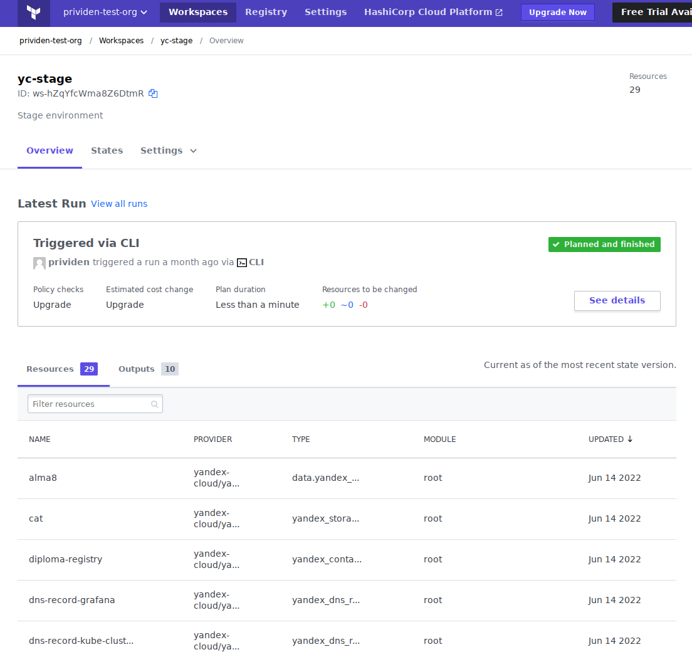

# Дипломный практикум в Yandex.Cloud (infrastructure)
В этом репозитории собраны файлы для деплоя инфраструктурной части дипломного проекта - 
конфиги Терраформа для создания облачных ресурсов и плейбуки Ансибля для развёртывания K8s-кластера и 
установки дополнений (dashboard, kube-prometheus).   
Также здесь находятся файлы для сборки образа Докера со всеми программами и модулями Питона, 
необходимыми для деплоя нашей инфраструктуры. Этот образ используется в CI/CD GitLab'а, там внутри контейнера 
и происходит вся работа по развёртыванию и конфигурированию всего и вся.

Файлы для тестового приложения выделены в отдельный репозиторий.


### Создание облачной инфраструктуры

С помощью Терраформа мы создаём подсети по числу зон доступности, виртуальные машины, которые мы равномерно распределяем 
по доступным подсетям, container registry для хранения образов нашего тестового приложения, S3-бакет для хранения 
статического контента тестового приложения, и DNS-записи в специально выделенной зоне `yc.complife.ru`

> 1. Создайте сервисный аккаунт, который будет в дальнейшем использоваться Terraform для работы с инфраструктурой с необходимыми и достаточными правами. Не стоит использовать права суперпользователя
```
$ yc iam service-account get terraform-agent
id: ajets5mrrf2u0dr735ra
folder_id: b1g200bppkibol684gqj
created_at: "2022-05-16T03:35:12Z"
name: terraform-agent
description: Service account for Terraform
```

Терраформ аутентифицируется этим сервисным аккаунтом с помощью IAM-ключа, который в json-формате содержится 
в файле, указанным в переменной `YC_SERVICE_ACCOUNT_KEY_FILE`.

```
$ yc resource-manager folder list-access-bindings default
+--------------------------+----------------+----------------------+
|         ROLE ID          |  SUBJECT TYPE  |      SUBJECT ID      |
+--------------------------+----------------+----------------------+
| resource-manager.admin   | serviceAccount | ajets5mrrf2u0dr735ra |
| container-registry.admin | serviceAccount | ajets5mrrf2u0dr735ra |
| editor                   | serviceAccount | ajets5mrrf2u0dr735ra |
+--------------------------+----------------+----------------------+
```
Роль `resource-manager.admin` нужна для создания S3-бакета и привязки к нему сервисного аккаунта. Роль `container-registry.admin` нужна 
для привязки сервисных аккаунтов к container registry.

---
> 2. Подготовьте backend для Terraform (Рекомендуемый вариант: Terraform Cloud)

Токен к аккаунту в TFC передаётся Терраформу в переменной [`TF_TOKEN_app_terraform_io`](https://registry.terraform.io/providers/hashicorp/tfe/latest/docs)

> снимки экрана из Terraform Cloud.



---
> 3. Настройте workspaces

В TFC созданы два воркспейса, `yc-stage` и `yc-prod`. Внутри конфигурации Терраформа они преобразуются в просто stage/prod, 
и в таком виде передаются и далее в плейбуки. Терраформ берёт нужный воркспейс из переменной `TF_WORKSPACE`.

В зависимости от выбранного воркспейса меняются ресурсы, выделенные кластеру, 
а так же выбирается соответствующее окружение для первоначального развёртывания тестового приложения.

### Создание Kubernetes кластера
Для развёртывания кластера мы используем Ansible / Kubespray, все дополнения также устанавливаем с помощью плейбуков.

Ансибль с помощью проекта [terraform-inventory](https://github.com/adammck/terraform-inventory) использует 
Терраформ-стейты в качестве динамического инвентори, при этом имена `compute_instances`-ресурсов превращаются в 
группы хостов, а все outputs доступны как ansible vars. Кроме того, для настройки Kubespray мы подключаем [дополнительное 
инвентори](custom-inventory).

SSH-ключ для доступа к хостам передаётся в переменных `ssh_key_pub` и `ssh_key_priv`.

Сразу вместе с кластером мы устанавливаем и 
[NGINX Ingress Controller](custom-inventory/group_vars/k8s_cluster/ingress_controller.yml), 
который будет использоваться в режиме `hostNetwork`.
Кажется, это самый простой путь получить для ингрессов 80/443 порты, без использования сервисов типа `loadBalancer`, 
которые зависят от облачного провайдера, или своего собственного балансировщика MetalLB, которому для анонса потребуются 
дополнительные IP-адреса.   
Кроме того, мы делаем DNS-запись для этого ингресс-контроллера с указанием IP всех воркер-нод, и на эту запись CNAME-ми 
вешаем записи для всех остальных ингрессов.

После успешного развёртывания кластера мы [импортируем](playbooks/import-cluster-config.yaml) его конфиг (далее он 
предоставляется требующим его программам с помощью переменной `KUBECONFIG`), [сохраняем](playbooks/save-infra-info.yaml)
некоторую информацию о кластере и инфраструктуре (которая потом используется при деплое тестового приложения), и 
[устанавливаем](playbooks/k8s-dashboard.yaml) Dashboard, токен доступа к которой сохраняем в артифакты сборки.

Wildcard-cертификат для наших веб-ресурсов мы предоставляем в переменных `tls_crt` и `tls_priv`.

### Подготовка cистемы мониторинга
В соответствии с рекомендациями, используем пакет kube-prometheus. Мы храним только 
[файл кастомных настроек](kube-prometheus/custom-setup.jsonnet), всё остальное [плейбук](playbooks/kube-prometheus.yaml) 
делает во время деплоя сам - инициализирует сборочную среду, собирает и применяет манифесты, подсовывает секрет с 
сертификатом. 

Пароль для Графаны передаётся в переменной `grafana_pass`.

### CI/CD
Мы будем использовать CI/CD от GitLab. Инфраструктура - дело серьёзно-опасное, да к тому же и не быстрое, поэтому тут
никакой автоматики, и для запуска пайплайна будем пользоваться исключительно кнопкой `Run pipeline` в веб-интерфейсе 
гитлаба, а выбор выполняемых в пайплайне задач мы будем делать с помощью указания специально обученных переменных. 

Стадий получилось многовато, но распараллелить задачи особенно не получится, они все зависят одна от другой. Последняя задача 
триггерит запуск пайплайна в репозитории тестового приложения, для его первоначального деплоя в свежесозданный кластер.

Для сборки образа инфраструктурного контейнера нужно запустить пайплайн с `BUILD_IMG`=1.

Для полного деплоя всей инфраструктуры нужно запустить пайплайн с `RUN_TESTS`=1 и `RUN_DEPLOY`=1.
